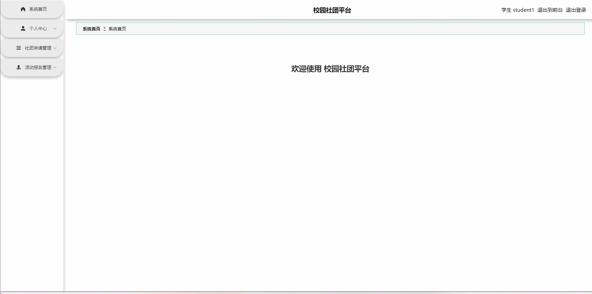
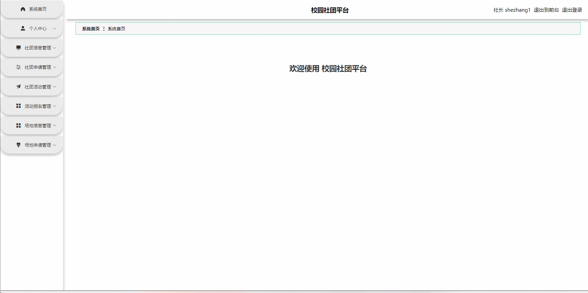
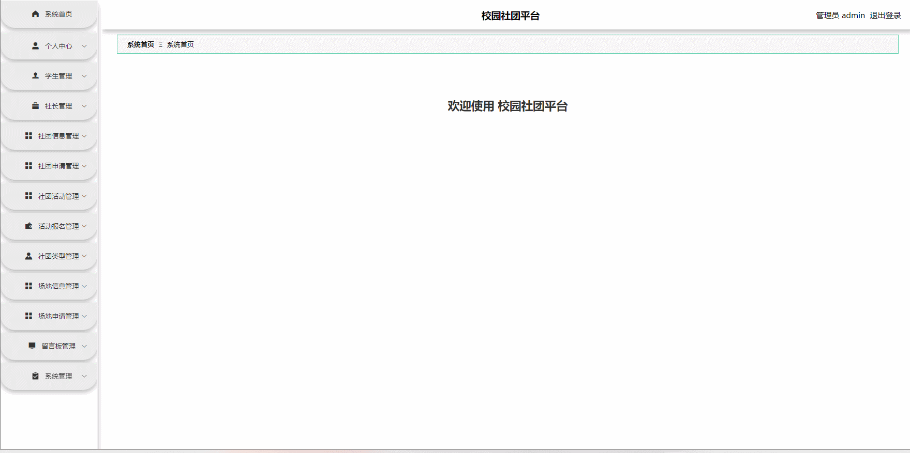

# school-club🎂

基于Vue+NodeJS的校园社团平台

## 介绍🌞

> 在开发当中用到Vue和Nodejs技术，让系统实现主要功能，比如管理学生模块、管理社长模块、管理社团信息模块、管理社团活动模块、公告信息模块、留言板模块、管理场地信息模块等。

## 项目演示🌞

**学生**

1. 申请加入社团


2. 申请活动报名


3. 个人信息


4. 后台



**社长**



**管理员**



## 安装教程🌞

```
1. 运行环境准备mysql8 + java8 + node14.16.1

2. 配置maven路径，加载依赖

3. 运行sql文件，确保application.yml或config.properties的数据库名称和账号密码是数据库所在主机的账号密码
```


## 使用说明🌞

```
1. 登入

	管理员账号：admin 密码：123456

    社长账号：shezhang1 密码：123456

    学生账号：student1 密码：123456
  
2. 运行流程

SpringBoot+Vue项目的部署详情可以查看这篇CSDN博客：http://t.csdnimg.cn/kpuxS

前后端不分离项目的部署流程可以查看这篇CSDN博客：http://t.csdnimg.cn/CslA5
```


## CSDN项目合集🌞

点击前往：http://t.csdnimg.cn/Q4u84


## 联系我🌞

**有偿获取完整源码或调试代码**

🐧：1902317191

wx：coding1902317191


